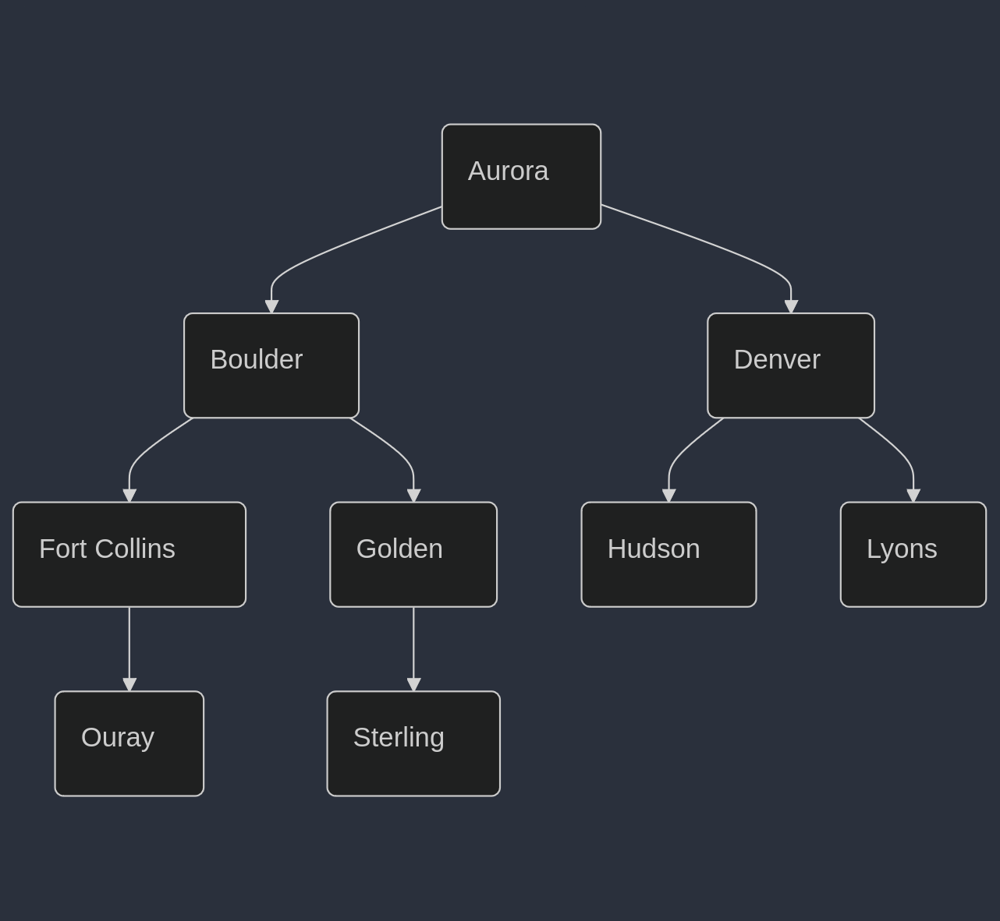

[Next Chapter](../advanced-sql/README.md)

---

# Indexes

1. **Indexes as a Secondary Data Structure**: When you create an index, it forms a secondary data structure. It keeps a
   copy of part of the data from the main table.

2. **Impact on Data Operations**: The index must be maintained whenever you insert, update, or delete data in the main
   table. This maintenance can become costly if there are many indexes, which is why adding unnecessary indexes is
   discouraged.

3. **Pointer Back to Main Table**: Every index contains a pointer back to the corresponding row in the main table,
   typically through the row ID.

4. **Index Design Philosophy**: While creating a database schema (e.g., assigning
   text to text columns, integers to integer columns) is straightforward, designing
   good indexes requires a more thoughtful, artistic approach. The schema is driven
   by the data, but indexes are driven by the queries or access patterns.

In essence, effective indexing depends on understanding how the data will be queried,
ensuring optimal performance based on those access patterns.

- [Creating and Using Indexes](./Intro-to-Indexes.md)
- [Other Types of Indexes](./Other-types-of-Indexes.md)

## B Trees

B Trees are the underlying data structure which makes indexing affective, performant, and powerful. They are
the way the data is arranged.

Running `playground_up.sql` inside of Datagrip should create a table which would have a B Tree structure like this:

### In the above tree structure we are looking at:

1. **Nodes**: B-trees consist of internal nodes and leaf nodes, where internal nodes contain keys and pointers to child
   nodes,
   while leaf nodes contain keys and hold the actual data.
2. **Keys**: The keys stored in the nodes are kept in sorted order and act as separators to guide search operations.
3. **Child Pointers**: Each internal node has pointers to child nodes, with the number of child pointers always being
   one
   more than the number of keys, facilitating traversal through the tree.

### Traversing The Tree

For the query `SELECT * FROM cities WHERE name = 'lyons'`, the tree is traversed based on the keys. Here's
how a traversal might look, given the simplified B-tree structure previously defined:

1. **Start at the root:**
    - Compare "lyons" with "aurora"
        - "lyons" is greater than "aurora"
        - Move to the right child (boulder and denver)

2. **Next node (Boulder):**

    - Compare "lyons" with "boulder"
        - "Lyons" is greater than "boulder"
        - move to the right child (denver)

3. **Next node (Denver):**

    - Compare "lyons" with "denver"
        - "lyons" is greater than "denver"
        - move to the right child (hudson and lyons)

4. **Next node (Hudson):**

    - Compare "lyons" with "hudson"
        - "lyons" is greater than "hudson"
        - move to the right child (lyons)

5. **Next node (Lyons):**
    - Compare "lyons" with "lyons"
    - Found "lyons"!

## Primary, Secondary, and Clustered Indexes

1. **Primary Key and Clustered Index**: In MySQL, when you declare a primary key, it also serves as the clustered index,
   determining how data is physically stored on disk. The primary key ensures that each row has a unique identifier,
   typically an ID column.

2. **Clustered Index Functionality**: The clustered index is represented as a B-tree, where leaf nodes contain actual
   row data. When querying by primary key, the database navigates the B-tree to retrieve the corresponding row data
   directly from the clustered index.

3. **Secondary Index**: A secondary index allows for additional lookup capabilities. When querying a secondary index (
   like a name index), the leaf nodes provide a pointer back to the primary key’s ID, necessitating a second lookup in
   the clustered index to retrieve the full row data.

4. **SQLite Comparison**: In SQLite, the primary key functions differently. The default clustered index is a hidden row
   ID, which means if a declared primary key is not an alias for this row ID, it acts as a secondary index. This can
   result in two lookups for queries using a primary key that isn't the row ID.

5. **Performance Implications**: Using auto-incrementing IDs as primary keys in MySQL results in efficient inserts,
   while using random UUIDs can lead to performance issues due to frequent B-tree re-balancing. In SQLite, UUIDs do not
   incur this penalty because the clustered index remains the row ID. However, non-alias primary keys in SQLite require
   two lookups, which may affect performance.

### How this Changes in a `WITHOUT ROWID` Table

1. **WITHOUT ROWID Tables**: In a typical SQLite table, a hidden row ID serves as the clustered index, but declaring a
   table as `WITHOUT ROWID` removes this hidden row ID. This changes how the primary key is handled, making it the
   clustered index, similar to MySQL or Postgres. This setup arranges the data on disk according to the primary key.

2. **Flexibility and Responsibility**: Without the hidden row ID, you're free to choose how your data is clustered using
   the primary key, but this requires careful consideration. For example, choosing a random UUID as the primary key
   could lead to performance issues, as inserting new rows could frequently break and re-balance the B-tree structure
   due
   to the randomness of the key values. On the other hand, using a sequential primary key, like an auto-incrementing
   integer, avoids such issues.

3. **Performance Tradeoffs**:

    - **Insert Penalty**: Using a random key as a primary key in a WITHOUT ROWID table can result in an insert penalty.
      The B-tree may need to re-balance often, which can slow down insertions.
    - **Read Benefit**: Without the row ID, a significant benefit is that you avoid the second lookup. With regular row
      ID tables, if the primary key is not an alias for the row ID, two lookups are necessary—one for the primary key,
      and another for the row ID in the clustered index. In WITHOUT ROWID tables, querying by the primary key provides
      direct access to the row data, potentially improving read performance.

4. **Example Scenario**: In a key-value store where the key is the primary key, a WITHOUT ROWID table would arrange the
   data on disk based on the key. The tradeoff to consider is whether the faster reads (due to skipping the second
   lookup) outweigh the potential slowdown during inserts caused by re-balancing the B-tree when using random primary
   keys like UUIDs.
