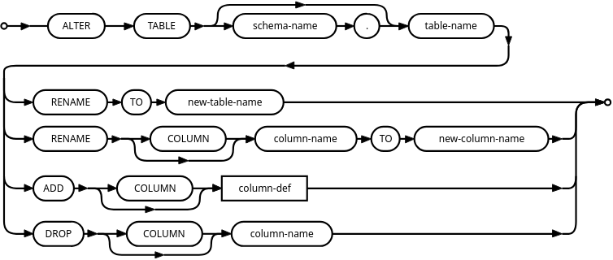

# Operating SQLite

## Altering Schema



> This diagram shows the available commands in SQLite for altering schemas or tables.

SQLite's documentation provides a [twelve-step process](#modifying-columns-the-twelve-step-process) for altering schema,
which can be simplified into four steps:

1. Create a New Table
2. Copy Data from Old Table to New Table
3. Drop the Old Table
4. Rename the New Table

```sqlite
PRAGMA FOREIGN_KEYS = off;

BEGIN TRANSACTION;
SELECT type, sql
FROM sqlite_schema
WHERE tbl_name = 'users';

CREATE TABLE users_new
(
    id         integer primary key autoincrement not null,
    first_name varchar                           not null,
    last_name  varchar                           not null,
    email      varchar                           not null,
    birthday   varchar,
    is_pro     integer                           not null default '0',
    deleted_at varchar,
    created_at datetime,
    updated_at datetime
);

CREATE INDEX idx_email ON users_new (email);
CREATE INDEX idx_name ON users_new (first_name, last_name);
CREATE INDEX idx_bday ON users_new (birthday);

INSERT INTO users_new
SELECT *
FROM users;

DROP TABLE users;

ALTER TABLE users_new
    RENAME TO users;
```

- [Documentation for Further Reading](https://sqlite.org/lang_altertable.html)

In the video, altering a table is discussed in detail. Four things can be done with `ALTER TABLE` in SQLite:

1. **Rename the Entire Table**: `ALTER TABLE users RENAME TO users_new`.
2. **Rename a Single Column**: `ALTER TABLE users RENAME COLUMN first_name TO first_name2`.
3. **Add a Column**: However, this new column will always be added to the end of the table.
4. **Drop a Column**: This is not supported directly in SQLite.

When compared to other databases, SQLite lacks the ability to modify a column definition (e.g., change data types or
constraints) or manage foreign keys easily through the `ALTER TABLE` command. This limitation arises from how SQLite
stores the schema: it stores the `CREATE TABLE` statement directly, prioritizing **backwards compatibility**.

### Renaming Columns

The process for renaming columns is straightforward, as demonstrated:

```sqlite
ALTER TABLE users
    RENAME COLUMN first_name TO first_name2;
SELECT *
FROM users; -- Returns first_name2 column
```

### Limitations on Adding Columns

One limitation is that when adding a new column, it is always appended to the end of the table, ensuring that SQLite
does not have to update the format of each row, preserving efficiency. If the column has constraints or is a generated
column, SQLite would need to touch each row, leading to slower operations.

### Modifying Columns (The Twelve-Step Process)

To modify columns (or do more advanced schema changes like adding foreign keys), SQLite's twelve-step process can be
simplified into four steps but expands for more complex operations. The full twelve-step process:

1. **Turn Off Foreign Keys**: `PRAGMA foreign_keys = OFF;`
2. **Begin a Transaction**: `BEGIN TRANSACTION;`
3. **Select the Current Schema**: Retrieve current schema details using
   `SELECT type, sql FROM sqlite_schema WHERE tbl_name = 'users';`.
4. **Create the New Table**: Define the new structure with changes.
5. **Copy Data**: Insert data from the old table into the new table.
6. **Drop the Old Table**: `DROP TABLE users;`
7. **Rename the New Table**: `ALTER TABLE users_new RENAME TO users;`
8. **Recreate Indexes and Triggers**.
9. **Recreate Views (if any)**.
10. **Run Foreign Key Check**: `PRAGMA foreign_key_check;`
11. **Commit the Transaction**: `COMMIT;`
12. **Re-enable Foreign Keys**: `PRAGMA foreign_keys = ON;`

This process is considered tedious and prone to error but ensures the changes you want (such as column definitions or
foreign key updates) are implemented correctly.

#### Other Strategies for Altering Schema

- Altering Schema with Tools
    - One option for working with SQLite is using the [`sqlite-utils`](https://github.com/simonw/sqlite-utils) package
      developed by Simon Willison.
    - Another options is to use an Open Source and Contribution fork of SQLite, like
      libSQL: https://github.com/tursodatabase/libsql.

---

## Backing up a SQLite Database

1. **Using `.backup`**
    - The `.backup` command is a built-in SQLite method for backing up your database. It ensures that ongoing writes to
      the database can continue, but any new writes after the backup command is issued will not be reflected in the
      backup.
    - This method does not lock the database during the backup process, making it ideal for situations where you need to
      keep the database operational while performing a backup.

   Example command:
   ```bash
   sqlite3 database.sqlite ".backup 'backup.sqlite'"
   ```

    - After running this command, you'll have an identical copy of the database at the point in time when the command
      was issued. It doesn't compress the data, meaning free pages from deleted entries are included.

2. **Compressing the Database During Backup with `VACUUM`**
    - When data is deleted in SQLite, it is not immediately removed but marked as free space, which can make the
      database larger than it needs to be. The `VACUUM` command reclaims this space, compressing the database as it
      backs it up.
    - Unlike `.backup`, `VACUUM` into another file is more CPU-intensive, but it results in a smaller, more compact
      database file. This method can be useful if you want to remove free pages and avoid carrying over deleted data in
      your backup.

   Example command:
   ```bash
   sqlite3 database.sqlite "vacuum into 'vacuumed.sqlite'"
   ```

    - After running this command, you'll notice the backup file is smaller. However, like `.backup`, it does not block
      writes to the database.

3. **Caution When Copying SQLite Files**
    - SQLite databases are generally single-file systems, but you may encounter scenarios where the database is split
      across two or more files (e.g., a database file and a WAL file). If you try copying these files manually while the
      database is being written to, you risk corrupting your backup.
    - It's recommended to use the built-in methods (`.backup` or `VACUUM`) instead of copying files directly unless
      you're absolutely certain no one is writing to the database. Manually copying the files during a write operation
      can be risky.

4. **Third-Party Tools for Backups**
    - If you're not using hosted services like Terso that handle backups automatically, there are third-party tools like
      **Lightstream** that can help with streaming backups. These tools operate by streaming the WAL file to external
      storage like S3, ensuring data consistency during writes.
    - Although they require some setup, these tools can provide a more robust solution for automatic backups, especially
      in scenarios where continuous backup streams are needed.

   However, the best first approach is to stick to the `.backup` or `VACUUM` methods, as they are reliable and built
   into SQLite itself.

---

## Exporting a SQLite Database

Exporting a SQLite database involves generating SQL statements that can be used to recreate the entire database in
another environment, such as a Postgres or MySQL system. This process is slightly different from backing up a
database, as it focuses on generating portable SQL that can be imported into other database systems.

1. **Using `.dump`**
   - The `.dump` command in SQLite outputs the entire database schema and data as a series of SQL statements. This is
     different from a backup, as the result is a text-based SQL script, not a database file that SQLite can directly
     open.
   - While this SQL file can’t be used directly as a database file, you can reimport it into SQLite (or another RDBMS)
     to recreate the database. This makes it a portable way to transfer data across systems.
     ```bash
     sqlite3 database.sqlite ".dump" > database_dump.sql
     ```

   - This command generates SQL statements for the entire database, including the schema and data. It's useful for
     exporting to other database engines or keeping a textual representation of the database.

2. **Compressing the Exported SQL with `gzip`**
   - Since the `.dump` command produces a large SQL file (with lots of repetitive text), it's a good idea to compress
     it using `gzip`.
     ```bash
     sqlite3 database.sqlite ".dump" | gzip > gzipped.sql.gz
     ```

   - Compressing the SQL dump significantly reduces its size. This is particularly useful if you're dealing with a
     large database, as SQL statements contain many repetitive patterns like `INSERT INTO` commands.

3. **Reimporting the SQL Dump**
   - Once you have an exported `.sql.gz` file, you can reimport it back into SQLite to recreate the database. This
     process involves decompressing the file and piping the SQL back into SQLite.
     ```bash
     gzip -d gzipped.sql.gz | sqlite3 new_database.sqlite
     ```

   - This command creates a new SQLite database from the SQL dump file, recreating all the tables and data from the
     original database.

4. **Recovering a Corrupted Database with `.recover`**
   - The `.dump` command is straightforward but will fail if the database is corrupted. In such cases, SQLite offers a
     `.recover` command that tries to salvage as much data as possible from a corrupt database.
   - If your database is in a "wonky" state (i.e., corrupted), `.recover` can recover much of the data, whereas `.dump`
     would stop at the first error.
     ```bash
     sqlite3 database.sqlite ".recover"
     ```

   - The output is similar to `.dump`, but `.recover` tries to bypass corrupted areas to extract as much usable data as
     possible.

5. **Using `.dump` vs Backup**
   - The `.dump` command exports the database as a set of SQL statements, making it ideal for migrating to different
     systems. However, this is not a typical backup. Backups created with `.backup` or `VACUUM` maintain the binary
     structure of the SQLite database, whereas `.dump` produces SQL text.
   - Exporting with `.dump` is useful when you need a clean, forensic-ready version of your data that is highly
     portable and compresses well.

6. **Export vs Backup**
   - While you can use `.dump` as a backup, its primary function is as an export tool. The resulting SQL file is more
     suitable for portability (e.g., migrating data to a different database system). If you need an actual backup, it’s
     better to use `.backup` or `VACUUM` methods.

## How to _Not_ Corrupt SQLite

SQLite is a robust, well-tested system, but improper handling of its files can lead to corruption. By following these
guidelines—never deleting the `-wal` file, not interfering with active database processes, and using proper tools—you
can avoid corruption and ensure your database remains reliable.

Stay cautious when interacting with SQLite, especially in multiprocess environments, and always rely on built-in safety
mechanisms like transactions and backup methods to protect your data.

### 1. Never Delete the WAL File

- **What is the WAL file?**
    - The `-wal` file stands for Write-Ahead Log. It contains data that hasn’t yet been committed to the main `.sqlite`
      database file.
- **Why is it important?**
    - If you delete the `-wal` file, you risk losing uncommitted data. This file is an essential part of the WAL
      journaling mode, where transactions are stored before they are fully written into the database.
- **Takeaway**: Always keep the `-wal` file until SQLite automatically deletes it after the transaction is fully
  committed.

### 2. What About the SHM File?

- **What is the SHM file?**
    - The `-shm` file stands for shared memory. It is used for coordinating transactions between processes. The file
      helps different processes communicate efficiently.
- **Is it important?**
    - While not as critical as the `-wal` file, the `-shm` file should not be deleted or modified directly. However,
      this file, like the `-wal` file, will automatically disappear once all database connections are closed.
- **Takeaway**: Let SQLite manage the `-shm` file; avoid deleting or tampering with it.

### 3. Don’t Move or Copy Files While They’re in Use

- **Why is this dangerous?**
    - Moving or copying SQLite database files while they are being accessed (especially if they are being written to)
      can easily lead to corruption.
- **What to do instead?**
    - If you need to move or copy the database files, ensure no one else is accessing the database at that time. You can
      start an **immediate transaction** to block other processes from writing. This will make sure no ongoing write
      operations interfere during the file operation.
- **Better solution**: Use SQLite’s **backup methods** (e.g., `.backup` command) to safely copy or move the database
  without risking corruption.
- **Takeaway**: Avoid copying or moving SQLite files during active use. Lock the database with an immediate transaction
  or use SQLite’s backup tools.

### 4. Don’t Write Directly to the Database File

- **What’s the risk?**
    - While SQLite databases are just regular files, writing to the file directly (e.g., opening it in a text editor or
      another tool) can easily corrupt the database.
- **Proper handling**: Always use approved tools (like SQLite’s CLI or appropriate libraries) to read from and write to
  the database.
- **Takeaway**: Never manually modify the database file. Always use SQLite-approved tools for interacting with the
  database.

### 5. Beware of Poor Locking Implementations

- **The problem with bad locking:**
    - SQLite relies on locking mechanisms to manage access between multiple processes. If your file system or operating
      system has a flawed locking implementation, you could end up with two processes writing to the database
      simultaneously, which could corrupt the database.
- **Is this common?**
    - Thankfully, most modern file systems have robust locking mechanisms. However, if you are using an older or
      non-standard file system, you should verify its locking capabilities.
- **Takeaway**: Ensure your environment uses a file system with a reliable locking mechanism to avoid potential
  corruption from concurrent writes.

### 6. Key Rule: Don’t Panic if You See Extra Files

- **What extra files?**
    - If you see files like `-wal` or `-shm`, don’t panic and don’t delete them. These files are part of SQLite’s normal
      operation.
- **What happens to these files?**
    - These files will automatically disappear when the last connection to the database is closed. If they remain, it
      could indicate an issue with open connections or incomplete transactions.
- **Takeaway**: Let SQLite manage its own temporary files. They are there for a reason.
