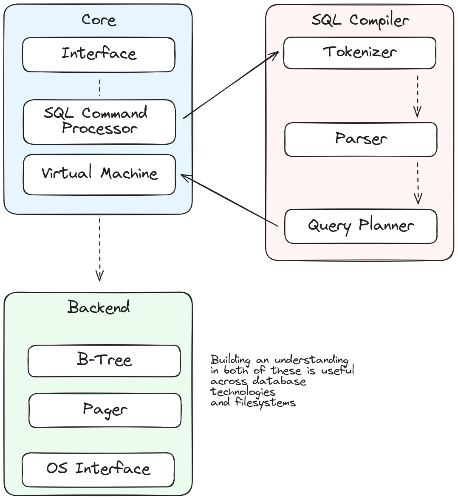

[Next Chapter](../schema/README.md)

---

# SQLite Internals



## SQLite File Format

A SQLite database is a single file and inside of this file you'll see equal sized
chunks of data called "Pages". The size of these pages is configurable from `512 bytes`
to `65536 bytes`, and is itself stored as a Page inside of the database. Another Page is
dedicated to managing locks.

## Dot Commands

Inside the SQLite command-line there are commands you can use:

- `.help` is a dot command which will bring up all of the available commands
- `.mode` select between output modes for queries (json, csv, md, insert)
- `.headers` show output of queries with header values
- `.shell` run shell command (i.e. `clear`)
- `.tables` lists all tables
- `.schema` shows you a SQL representation of the database schema
- `.expert` suggests optimizations over your SQLite database

## Pragma Statements

Pragma statements are used for configuration/optimizing your database
each apply to either the session or the database level.

- `pragma page_count;` and `pragma page_size;` tell you about the size of a database
- `pragma foreign_keys=[0|1];` - changes whether foreign keys are enforced (session-level)
- `pragma compile_options;` view how the database was compiled
- `.dbconfig` is a dot command which gives you a quick view of a database configuration

## Virtual Tables

SQLite3 has the ability to create a virtual table against a data source, like a csv file
and run SQL queries against it.

```sqlite
-- Load the csv extension with `.load ./csv`

CREATE VIRTUAL TABLE temp.t1 USING csv
(
    filename="sample.csv",
    header = true
);
SELECT *
FROM t1;
```
